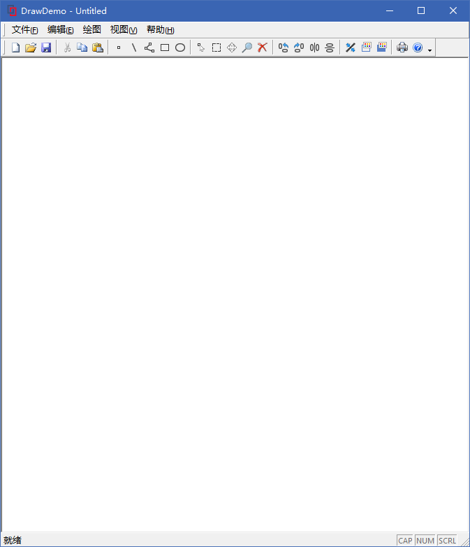
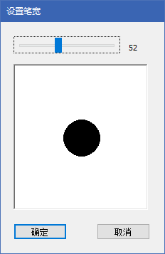

<a href="https://github.com/lucka-me/DrawDemo"><div align=center></div></a>

<h1 align=center>DrawDemo 说明书</h1>

<p align="center">
  <a href="#基本信息">基本信息</a> ·
  <a href="#开发环境">开发环境</a> ·
  <a href="#功能">功能</a> ·
  <a href="#用户界面设计">用户界面设计</a> ·
  <a href="#数据结构设计">数据结构设计</a> ·
  <a href="#参考资料">参考资料</a>
</p>

<div align=center></div>

<p align="center">
  <font color="gray">链接至本说明书的二维码</font>
</p>

## 基本信息
- 软件名称：DrawDemo
- 软件类型：MFC 单文档应用程序

## 开发环境
- 操作系统：Windows 10
- IDE：Microsoft Visual Studio Community 2017

## 功能
- 文件
  - 新建、打开、保存文件
- 编辑
  - 复制、粘贴
  - 点选、选取范围（框选）、全选
  - 移动、缩放、删除
  - 顺时针旋转90°、逆时针旋转90°、水平对称、垂直对称
  - 更改图形线宽、颜色、填充颜色
  - 设置画笔颜色、填充颜色、橡皮筋颜色、画笔宽度、橡皮筋宽度
  - 取消操作
- 绘图
  - 画点、线、折线、矩形、多边形<sup>`1.1.0`</sup>、椭圆
  - 画线、折线、矩形和椭圆时显示橡皮线
- 在绘图、编辑时显示鼠标坐标
- 工具栏操作
- 注册表操作，包括快捷键注册、工具栏注册、`.ddd` 文档类型和文档图标注册
- 快捷键操作

### 快捷键列表
| Hot Key           | Description
| :---------------- | :----------
| `Ctrl + N`        | 新建文件
| `Ctrl + S`        | 保存文件
| `Ctrl + C`        | 复制
| `Ctrl + V`        | 粘贴
| `Ctrl + A`        | 全选
| `M`               | 选取范围
| `V`               | 移动
| `Z`               | 缩放
| `Del` `Backspace` | 删除
| `Esc`             | 取消操作

### 文档类型
- 后缀名：`.ddd`
- 文档类型名称：DrawDemo Draw 文档
- 文档图标：

<div align=center></div>

## 用户界面设计
为本程序设计和制作的用户界面主要包括主视图和画笔宽度设置对话框两个界面。

### 主视图及菜单
软件主视图由菜单栏、工具栏、绘图区域和状态栏构成，其中工具栏可通过 MFC 默认提供的编辑器自由修改。

<div align=center></div>

### 画笔宽度设置对话框
画笔宽度设置对话框由设置滑条、笔宽显示和笔宽预览区域构成。

<div align=center></div>

## 数据结构设计
本程序的核心数据结构包括 `CObject` 的派生类 `Element` 和其派生类 `EPoint`、`ELine`、`EPolyline`、`ERectangle`、`EPolygon`、`EEllipse`，它们用于存储各种图形、进行图形变换，以及用于存储图形的指针数组 `ElementArray`，同时还有控制主视图的 `CDrawDemoView` 及控制画笔宽度设置对话框的 `CPenWidthDialog` 类。

### 目录
- [ElementType](#elementtype)
- [enum Operation](#enum-operation)
- [Element](#element)
- [EPoint](#epoint)
- [ELine](#eline)
- [EPolyline](#epolyline)
- [ERectangle](#erectangle)
- [EPolygon](#epolygon110)
- [EEllipse](#eellipse)
- [ElementArray](#elementarray)
- [CDrawDemoDoc](#cdrawdemodoc)
- [CDrawDemoView](#cdrawdemoview)
- [CPenWidthDialog](#cpenwidthdialog)

### ElementType
用于标识 `Element` 图形的子类类型。

#### 语法
```cpp
typedef enum _ElementType
```

#### 枚举列表
| Name           | Description
| :------------- | :----------
| `ET_NONE`      | 无类型，`Element`
| `ET_POINT`     | 点，`EPoint`
| `ET_LINE`      | 线，`ELine`
| `ET_POLYLINE`  | 折线，`EPolyline`
| `ET_RECTANGLE` | 矩形，`ERectangle`
| `ET_POLYGON`   | 多边形，`EPolygon`<sup>`1.1.0`</sup>
| `ET_ELLIPSE`   | 椭圆，`EEllipse`

### enum Operation
用于标识 `CDrawDemoView` 中的操作类型
###### 枚举列表
| Name                    | Description
| :---------------------- | :----------
| `OPR_NONE` 							| 无操作
| `OPR_DRAW_POINT` 				| 绘制点
| `OPR_DRAW_LINE` 				| 绘制线
| `OPR_DRAW_POLYLINE`			| 绘制折线
| `OPR_DRAW_RECTANGLE` 		| 绘制矩形
| `OPR_DRAW_POLYLINE`     | 绘制多边形<sup>`1.1.0`</sup>
| `OPR_DRAW_ELLIPSE` 			| 绘制椭圆
| `OPR_EDIT_SELECT` 			| 点选
| `OPR_EDIT_SELECT_RANGE` | 选取范围
| `OPR_EDIT_MOVE`         | 移动
| `OPR_EDIT_ZOOM`         | 缩放
| `OPR_EDIT_ROTATE_CW`    | 顺时针旋转
| `OPR_EDIT_ROTATE_CCW`   | 逆时针旋转
| `OPR_EDIT_SYMMETRY_H`   | 水平对称
| `OPR_EDIT_SYMMETRY_V`   | 水平对称

### Element
DrawDemo 的核心类，是所有图形类的基类，提供序列化、获取图形类型、绘制图形、复制、选择、移动、缩放、对称、旋转的虚函数，以及一个颜色变量。

其中点图形 `EPoint` 是其余各类图形的基础。

#### 继承关系
##### 基类
- `CObject`

##### 派生类
- `EPoint`
- `ELine`
- `EPolyline`
- `ERectangle`
- `EPolygon`<sup>`1.1.0`</sup>
- `EEllipse`

#### 成员
以下列出新增和重写的成员。

##### 公共方法
| Name                      | Description
| :------------------------ | :----------
| `Element::Element`        | 默认构造函数
| `Element::~Element`       | 默认析构函数
| `Element::Serialize`      | 序列化
| `Element::GetElementType` | 获取图形类型
| `Element::Draw`           | 绘制图形
| `Element::Copy`           | 复制
| `Element::Select`         | 选择
| `Element::Move`           | 移动
| `Element::Zoom`           | 缩放
| `Element::RotateCW`       | 顺时针旋转
| `Element::RotateCCW`      | 逆时针旋转
| `Element::SymmetryH`      | 水平对称
| `Element::SymmetryV`      | 垂直对称

##### 公共变量
| Name             | Type       | Description
| :--------------- | :--------- | :----------
| `Element::color` | `COLORREF` |图形颜色

#### Element::Element
```cpp
Element();
```
构造 `Element` 实体，同时将成员 `color` 设置为黑色 `RGB(0, 0, 0)`
#### Element::~Element
```cpp
virtual ~Element();
```
默认析构函数。

#### Element::Serialize
```cpp
virtual void Serialize(CArchive & ar);
```
序列化，将成员 `color` 序列化/反序列化。

#### Element::GetElementType
```cpp
virtual ElementType GetElementType();
```
返回图形类型，`Element` 类实体则返回 `ET_NONE`

#### Element::Draw
```cpp
virtual void Draw(CDC & dc);
virtual void Draw(CDC & dc, COLORREF coverColor);
```
绘制图形，若不指定 `coverColor` 则以自身 `color` 作为画笔颜色。

#### Element::Copy
```cpp
virtual Element * Copy();
```
复制一个新的实体并返回新实体的指针。

#### Element::Select
```cpp
virtual bool Select(CPoint point, unsigned short buffer = 2);
virtual bool Select(CRect rangeRect);
```
若传入一个 `CPoint` 则判此点是否选中图形（点选），缓冲区大小 `buffer` 默认为2。

若传入一个 `CRect` 则判断此区域是否选中图形（选取区域），此时不支持缓冲区。

#### Element::Move
```cpp
virtual void Move(int deltaX, int deltaY);
```
将图形向 X 轴方向移动 `deltaX`，向 Y 轴移动 `deltaY`。

#### Element::Zoom
```cpp
virtual void Zoom(CPoint center, double level);
```
以 `center` 为中心，进行比例为 `level` 的缩放。

#### Element::RotateCW
```cpp
virtual void SymmetryH(int axisX);
```
以 `axisX` 为对称轴水平对称。

#### Element::RotateCCW
```cpp
virtual void SymmetryV(int axisY);
```
以 `axisY` 为对称轴垂直对称。

#### Element::SymmetryH
```cpp
virtual void RotateCW(CPoint center);
```
以 `center` 为中心顺时针旋转90°。

#### Element::SymmetryV
```cpp
virtual void RotateCCW(CPoint center);
```
以 `center` 为中心逆时针旋转90°。

### EPoint
表示点图形，在重写 `Element` 所有方法的基础上提供设置坐标、设置颜色和获取相应 `CPoint` 的方法。绘制图形时将以一个 4×4 像素的矩形表示。

是其余各图形的基础，它们的端点/顶点均以 `EPoint` 类成员存储，在进行图形变换时也要调用 `EPoint` 的相应方法。

#### 继承关系
##### 基类
- `Element`

#### 成员
以下列出新增的成员。

##### 公共方法
| Name                | Description
| :------------------ | :----------
| `EPoint::EPoint`    | 默认构造函数
| `EPoint::~EPoint`   | 默认析构函数
| `EPoint::Set`       | 设置点的坐标
| `EPoint::SetColor`  | 设置颜色
| `EPoint::GetCPoint` | 获取相应的 `CPoint`

##### 公共变量
| Name        | Type  |Description
| :---------- | :---- | :----------
| `EPoint::x` | `int` | 点的 X 坐标
| `EPoint::y` | `int` | 点的 Y 坐标

#### EPoint::EPoint
```cpp
EPoint();
```
默认构造函数，将坐标初始化为 `(0, 0)`。

#### EPoint::~EPoint
```cpp
~EPoint();
```
默认析构函数。

#### EPoint::Set
```cpp
void Set(CPoint point);
```
设置坐标为 `point` 的坐标。

#### EPoint::SetColor
```cpp
void SetColor(COLORREF newColor);
```
设置点的显示颜色为 `newColor`。

#### EPoint::GetCPoint
```cpp
CPoint GetCPoint();
```
返回相应的 `CPoint`，可用于调用 MFC 中的其它方法。

### ELine
表示线图形，在重写 `Element` 所有方法的基础上提供设置端点、设置颜色和设置线宽的方法。

在移动、缩放、旋转时实际上是对两 `EPoint` 类端点成员进行相应的操作。

#### 继承关系
##### 基类
- `Element`

#### 成员
以下列出新增的成员。

##### 公共方法
| Name                  | Description
| :-------------------- | :----------
| `ELine::ELine`        | 默认构造函数
| `ELine::~ELine`       | 默认析构函数
| `ELine::Set`          | 设置线的端点
| `ELine::SetLineColor` | 设置颜色
| `ELine::SetLineWidth` | 设置线宽

##### 私有变量
| Name           | Type     | Description
| :------------- | :------- | :----------
| `ELine::start` | `EPoint` | 起始端点
| `ELine::end`   | `EPoint` | 终止端点
| `ELine::width` | `int`    | 线宽

#### ELine::ELine
```cpp
ELine();
```
默认构造函数，并将线宽初始化为1。

#### ELine::~ELine
```cpp
~ELine();
```
默认析构函数。

#### ELine::Set
```cpp
void Set(CPoint startPoint, CPoint endPoint);
```
设置线的端点

#### ELine::SetLineColor
```cpp
void SetLineColor(COLORREF newColor);
```
设置线的颜色为 `newColor`。

#### ELine::SetLineWidth
```cpp
void SetLineWidth(unsigned short newWidth);
```
设置线宽为 `newWidth`。

### EPolyline
表示折线图形，在重写 `Element` 所有方法的基础上提供设置/增加节点、设置颜色、设置线宽和绘制最后一段线的方法。

在移动、缩放、旋转时实际上是对 `nodeList` 中各 `EPoint` 成员进行相应的操作。

#### 继承关系
##### 基类
- `Element`

#### 成员
以下列出新增的成员。

##### 公共方法
| Name                      | Description
| :------------------------ | :----------
| `EPolyline::EPolyline`    | 默认构造函数
| `EPolyline::~EPolyline`   | 默认析构函数
| `EPolyline::Set`          | 设置折线的首两个节点
| `EPolyline::Add`          | 添加节点
| `EPolyline::SetLineColor` | 设置颜色
| `EPolyline::SetLineWidth` | 设置线宽
| `EPolyline::DrawLast`     | 绘制最后一段线

##### 私有变量
| Name                  | Type           | Description
| :-------------------- | :------------- | :----------
| `EPolyline::nodeList` | `ElementArray` | 节点列表
| `EPolyline::width`    | `int`          | 线宽

#### EPolyline::EPolyline
```cpp
EPolyline();
```
默认构造函数，将线宽初始化为1。

#### EPolyline::~EPolyline
```cpp
~EPolyline();
```
默认析构函数。

#### EPolyline::Set
```cpp
void Set(CPoint startNode, CPoint secondNode);
```
清空 `nodeList` ，设置折线的首两个节点为 `startNode` 和 `secondNode` 并将之加入 `nodeList` 中。

#### EPolyline::Add
```cpp
void Add(CPoint newNode);
```
将节点 `newNode` 加入 `nodeList` 中。

#### EPolyline::SetLineColor
```cpp
void SetLineColor(COLORREF newColor);
```
设置线颜色为 `newColor`。

#### EPolyline::SetLineWidth
```cpp
void SetLineWidth(unsigned short newWidth);
```
设置线宽为 `newWidth`。

#### EPolyline::DrawLast
```cpp
void DrawLast(CDC & dc);
```
在 `dc` 上绘制最后一段线及最后的节点，用于提高绘图时的效率。

### ERectangle
表示矩形图形，用一对对角定点确定位置和大小。在重写 `Element` 所有方法的基础上提供设置对角顶点、设置颜色、设置填充和设置线宽的方法。

在移动、缩放、旋转时实际上是对 `nodeList` 中各 `EPoint` 成员进行相应的操作。

#### 继承关系
##### 基类
- `Element`

#### 成员
以下列出新增的成员。

##### 公共方法
| Name                       | Description
| :------------------------- | :----------
| `ERectangle::ERectangle`   | 默认构造函数
| `ERectangle::~ERectangle`  | 默认析构函数
| `ERectangle::Set`          | 设置对角顶点
| `ERectangle::SetLineColor` | 设置颜色
| `ERectangle::SetFillColor` | 设置填充
| `ERectangle::SetLineWidth` | 设置线宽

##### 私有变量
| Name                    | Type       | Description
| :---------------------- | :--------- | :----------
| `ERectangle::pointA`    | `EPoint`   | 顶点 A
| `ERectangle::pointB`    | `EPoint`   | 顶点 B
| `ERectangle::lineWidth` | `int`      | 线宽
| `ERectangle::fillColor` | `COLORREF` | 填充

#### ERectangle::ERectangle
```cpp
ERectangle();
```
默认构造函数，将线宽初始化为1，并将填充初始化为白色 `RGB(255, 255, 255)`。

#### ERectangle::~ERectangle
```cpp
~ERectangle();
```
默认析构函数。

#### ERectangle::Set
```cpp
void Set(CPoint A, CPoint B);
```
设置对角顶点为 `A` 和 `B`。

#### ERectangle::SetLineColor
```cpp
void SetLineColor(COLORREF newLineColor);
```
设置线颜色为 `newColor`。

#### ERectangle::SetFillColor
```cpp
void SetFillColor(COLORREF newFillColor);
```
设置填充为 `newFillColor`。

#### ERectangle::SetLineWidth
```cpp
void SetLineWidth(unsigned short newLineWidth);
```
设置线宽为 `newLineWidth`。


### EPolygon<sup>`1.1.0`</sup>
表示多边形图形，与折线 `EPolyline` 类似，在重写 `Element` 所有方法的基础上提供设置/增加节点、设置颜色、设置填充、设置线宽和绘制最后一段线的方法。

在移动、缩放、旋转时实际上是对 `nodeList` 中各 `EPoint` 成员进行相应的操作。

#### 继承关系
##### 基类
- `Element`

#### 成员
以下列出新增的成员。

##### 公共方法
| Name                      | Description
| :------------------------ | :----------
| `EPolygon::EPolygon`      | 默认构造函数
| `EPolygon::~EPolygon`     | 默认析构函数
| `EPolygon::Set`           | 设置折线的首两个节点
| `EPolygon::Add`           | 添加节点
| `EPolygon::SetLineColor`  | 设置颜色
| `EPolygon::SetFillColor`  | 设置填充
| `EPolygon::SetLineWidth`  | 设置线宽
| `EPolygon::GetCPointList` | 获取 `CPoint` 类型的节点数组
| `EPolygon::DrawLast`      | 绘制最后一段线

##### 私有变量
| Name                  | Type           | Description
| :-------------------- | :------------- | :----------
| `EPolygon::nodeList`  | `ElementArray` | 节点列表
| `EPolygon::lineWidth` | `int`          | 线宽
| `EPolygon::fillColor` | `COLORREF`     | 填充

#### EPolygon::EPolyline
```cpp
EPolyline();
```
默认构造函数，将线宽初始化为1，并将填充初始化为白色 `RGB(255, 255, 255)`。

#### EPolygon::~EPolyline
```cpp
~EPolyline();
```
默认析构函数。

#### EPolygon::Set
```cpp
void Set(CPoint startNode, CPoint secondNode);
```
清空 `nodeList` ，设置多边形的首两个节点为 `startNode` 和 `secondNode` 并将之加入 `nodeList` 中。

#### EPolygon::Add
```cpp
void Add(CPoint newNode);
```
将节点 `newNode` 加入 `nodeList` 中。

#### EPolygon::SetLineColor
```cpp
void SetLineColor(COLORREF newColor);
```
设置线颜色为 `newColor`。

#### EPolygon::SetFillColor
```cpp
void SetFillColor(COLORREF newColor);
```
设置填充为 `newColor`。

#### EPolygon::SetLineWidth
```cpp
void SetLineWidth(unsigned short newWidth);
```
设置线宽为 `newWidth`。

#### EPolygon::GetCPointList
```cpp
CPoint * GetCPointList();
```
获取 `CPoint` 类的节点数组，可用于 `CDC::Polygon` 绘制多边形。

#### EPolygon::DrawLast
```cpp
void DrawLast(CDC & dc);
```
在 `dc` 上绘制最后一段线，用于提高绘图时的效率。


### EEllipse
表示矩形图形，与矩形 `ERectangle` 类似。以外接矩形的对角顶点确定位置和大小。在重写 `Element` 所有方法的基础上提供设置外接矩形对角顶点、设置颜色、设置填充和设置线宽的方法。

在移动、缩放、旋转时实际上是对 `nodeList` 中各 `EPoint` 成员进行相应的操作。

#### 继承关系
##### 基类
- `Element`

#### 成员
以下列出新增的成员。

##### 公共方法
| Name                     | Description
| :----------------------- | :----------
| `EEllipse::EEllipse`     | 默认构造函数
| `EEllipse::~EEllipse`    | 默认析构函数
| `EEllipse::Set`          | 设置外接矩形对角顶点
| `EEllipse::SetLineColor` | 设置颜色
| `EEllipse::SetFillColor` | 设置填充
| `EEllipse::SetLineWidth` | 设置线宽

##### 私有变量
| Name                  | Type       | Description
| :-------------------- | :--------- | :----------
| `EEllipse::pointA`    | `EPoint`   | 外接矩形顶点 A
| `EEllipse::pointB`    | `EPoint`   | 外接矩形顶点 B
| `EEllipse::lineWidth` | `int`      | 线宽
| `EEllipse::fillColor` | `COLORREF` | 填充

#### EEllipse::EEllipse
```cpp
EEllipse();
```
默认构造函数，将线宽初始化为1，并将填充初始化为白色 `RGB(255, 255, 255)`。

#### EEllipse::~EEllipse
```cpp
~EEllipse();
```
默认析构函数。

#### EEllipse::Set
```cpp
void Set(CPoint A, CPoint B);
```
设置外接矩形对角顶点为 `A` 和 `B`。

#### EEllipse::SetLineColor
```cpp
void SetLineColor(COLORREF newLineColor);
```
设置线颜色为 `newColor`。

#### EEllipse::SetFillColor
```cpp
void SetFillColor(COLORREF newFillColor);
```
设置填充为 `newFillColor`。

#### EEllipse::SetLineWidth
```cpp
void SetLineWidth(unsigned short newLineWidth);
```
设置线宽为 `newLineWidth`。

### ElementArray
用于存储 `Element` 及其派生类的指针数组，长度可变且可序列化，在 `CTypedPtrArray` 的基础上提供以指针查找和删除列表成员的功能。

##### 基类
- `CTypedPtrArray<CObArray, Element *>`

#### 成员
以下列出新增的成员。

##### 公共方法
| Name                          | Description
| :---------------------------- | :----------
| `ElementArray::ElementArray`  | 默认构造函数
| `ElementArray::~ElementArray` | 默认析构函数
| `ElementArray::HasElement`    | 查找图形是否在列表中
| `ElementArray::Remove`        | 删除图形

#### ElementArray::ElementArray
```cpp
ElementArray();
```
默认构造函数。

#### ElementArray::~ElementArray
```cpp
~ElementArray();
```
默认析构函数。

#### ElementArray::HasElement
```cpp
bool HasElement(Element * pContent);
```
查找图形的指针 `pContent` 是否在列表中，是则返回 `true`，否则返回 `false`。

#### ElementArray::Remove
```cpp
bool Remove(Element * pContent);
```
从列表中删除指定图形的指针 `pContent`，删除成功则返回 `true`，删除失败或未查找到指定指针则返回 `false`。

### CDrawDemoDoc
DrawDemo 中负责操作文档的类，包含成员 `dataList` 用于保存全部图形，并重写序列化函数，可将 `dataList` 中的图形存入文档/从文档中取出。

#### 继承关系
##### 基类
- `CDocument`

#### 成员
以下包含除 Visual Studio 自动生成的代码之外新增和重写的成员。

##### 公共方法
| Name                      | Description
| :------------------------ | :----------
| `CDrawDemoDoc::Serialize` | 序列化

##### 公共变量
| Name                     | Type           | Description
| :----------------------- | :------------- | :----------
| `CDrawDemoDoc::dataList` | `ElementArray` | 用于文件存储和编辑操作的图形列表

### CDrawDemoView
DrawDemo 中负责操作主视图的类，包含绘图和编辑所需的所有方法和变量，并包含了响应菜单消息和鼠标消息的映射函数。

#### 继承关系
##### 基类
- `CView`

#### 成员
以下包含除 Visual Studio 自动生成的成员之外新增和重写的成员。

##### 公共方法
| Name                                   | Description
| :------------------------------------- | :----------
| `CDrawDemoView::OnDraw`                | 绘制图形
| `CDrawDemoView::UpdateStatusBar`       | 更新状态栏消息
| `CDrawDemoView::ResetStatusBar`        | 重置状态栏消息
| `CDrawDemoView::CancelOpr`             | 取消操作
| `CDrawDemoView::CheckEditListNotEmpty` | 检查是否选择图形并弹出提示

##### 公共变量
| Name                            | Type             | Description
| :------------------------------ | :--------------- | :----------
| `CDrawDemoView::editList`       | `ElementArray`   | 用于文件存储和编辑操作的图形列表
| `CDrawDemoView::clipboard`      | `ElementArray`   | 用于文件存储和编辑操作的图形列表
| `CDrawDemoView::clientRect`     | `CRect`          | 绘图区域矩形
| `CDrawDemoView::clickCount`     | `int`            | 左键点击次数
| `CDrawDemoView::oprType`        | `enum Operation` | 当前操作类别
| `CDrawDemoView::pointStart`     | `CPoint`         | 起始点
| `CDrawDemoView::pointLastMouse` | `CPoint` 				 | 上一个鼠标点
| `CDrawDemoView::auxPenColor`    | `COLORREF`			 | 辅助线颜色
| `CDrawDemoView::auxPenWidth`    | `int`						 | 辅助线宽
| `CDrawDemoView::selectedColor`  | `COLORREF`			 | 已选图形颜色
| `CDrawDemoView::penColor`       | `COLORREF`			 | 点和线颜色
| `CDrawDemoView::fillColor`      | `COLORREF`			 | 填充颜色
| `CDrawDemoView::lineWidth`      | `int`						 | 画笔线宽

##### 消息映射函数
| Name                 | Message ID               | Description
| :------------------- | :----------------------- | :----------
| `OnFileSave`         | `ID_FILE_SAVE`           | 文件-保存
| `OnDrawPoint`        | `ID_DRAW_POINT`          | 菜单-绘图-点
| `OnDrawLine`         | `ID_DRAW_LINE`           | 菜单-绘图-线
| `OnDrawPolyline`     | `ID_DRAW_POLYLINE`       | 菜单-绘图-折线
| `OnDrawRectangle`    | `ID_DRAW_RECTANGLE`      | 菜单-绘图-矩形
| `OnDrawEllipse`      | `ID_DRAW_ELLIPSE`        | 菜单-绘图-椭圆
| `OnEditCopy`         | `ID_EDIT_COPY`           | 菜单-编辑-复制
| `OnEditPaste`        | `ID_EDIT_PASTE`          | 菜单-编辑-粘贴
| `OnEditSelect`       | `ID_EDIT_SELECT`         | 菜单-编辑-点选
| `OnEditSelectRange`  | `ID_EDIT_SELECT_RANGE`   | 菜单-编辑-选取范围
| `OnEditSelectAll`    | `ID_EDIT_SELECT_ALL`     | 菜单-编辑-全选
| `OnEditMove`				 | `ID_EDIT_MOVE`           | 菜单-编辑-移动
| `OnEditZoom`			   | `ID_EDIT_ZOOM`           | 菜单-编辑-缩放
| `OnEditDelete`		   | `ID_EDIT_DELETE`         | 菜单-编辑-删除
| `OnEditRotateCW`		 | `ID_EDIT_ROTATE_CW`      | 菜单-编辑-旋转-顺时针旋转
| `OnEditRotateCCW`	   | `ID_EDIT_ROTATE_CCW`     | 菜单-编辑-旋转-逆时针旋转
| `OnEditSymmetryH`	   | `ID_EDIT_SYMMETRY_H`     | 菜单-编辑-旋转-水平对称
| `OnEditSymmetryV`	   | `ID_EDIT_SYMMETRY_V`     | 菜单-编辑-旋转-垂直对称
| `OnEditChangeWidth`  | `ID_EDIT_CHANGE_WIDTH`   | 菜单-编辑-更改-线宽
| `OnEditChangeColor`  | `ID_EDIT_CHANGE_COLOR`   | 菜单-编辑-更改-颜色
| `OnEditChangeFill`   | `ID_EDIT_CHANGE_FILL`    | 菜单-编辑-更改-填充
| `OnEditSetColorPen`  | `ID_EDIT_SET_COLOR_PEN`  | 菜单-编辑-颜色-画笔颜色
| `OnEditSetColorFill` | `ID_EDIT_SET_COLOR_FILL` | 菜单-编辑-颜色-填充颜色
| `OnEditSetColorAux`  | `ID_EDIT_SET_COLOR_AUX`  | 菜单-编辑-颜色-橡皮筋颜色
| `OnEditSetWidthPen`  | `ID_EDIT_SET_WIDTH_PEN`  | 菜单-编辑-笔宽-画笔宽度
| `OnEditSetWidthAux`  | `ID_EDIT_SET_WIDTH_AUX`  | 菜单-编辑-笔宽-橡皮筋宽度
| `OnLButtonDown`      | `ON_WM_LBUTTONDOWN`      | 鼠标左键按下
| `OnLButtonUp`        | `ON_WM_LBUTTONUP`        | 鼠标左键弹起
| `OnRButtonDown`      | `ON_WM_RBUTTONDOWN`      | 鼠标右键按下
| `OnRButtonUp`        | `ON_WM_RBUTTONUP`        | 鼠标右键弹起
| `OnMouseMove`        | `ON_WM_MOUSEMOVE`        | 鼠标移动
| `OnMouseWheel`       | `ON_WM_MOUSEWHEEL`       | 鼠标滚轮滚动
| `OnCancelOpr`        | `ID_CANCEL_OPR`          | 菜单-编辑-取消

### CPenWidthDialog
DrawDemo 中负责操作设置笔宽对话框的类，包含初始化对话框、滑条设置、预览笔宽、在父视图中获取新笔宽所需的所有方法和变量，并包含了响应滑条消息的映射函数。

笔宽的设置范围为 1~127。

#### 继承关系
##### 基类
- `CDialogEx`

#### 成员
以下包含除 Visual Studio 自动生成的成员之外新增和重写的成员。

##### 公共方法
| Name                               | Description
| :--------------------------------- | :----------
| `CPenWidthDialog::CPenWidthDialog` | 构造函数
| `CPenWidthDialog::OnInitDialog`    | 初始化对话框
| `CPenWidthDialog::GetPenWidth`     | 获取设置好的笔宽

##### 私有变量
| Name                           | Type             | Description
| :----------------------------- | :--------------- | :----------
| `CPenWidthDialog::penWidth`    | `unsigned short` | 笔宽
| `CPenWidthDialog::slider`      | `CSliderCtrl`    | 滑条
| `CPenWidthDialog::staticText`  | `CStatic`        | 显示笔宽的静态文本控件
| `CPenWidthDialog::preview`     | `CStatic`        | 预览笔宽的静态控件
| `CPenWidthDialog::previewRect` | `CRect`          | 预览笔宽的静态控件区域
| `CPenWidthDialog::pPreviewDC`  | `CDC *`          | 预览笔宽的静态控件显示

##### 消息映射函数
| Name        | Message ID      | Description
| :---------- | :-------------- | :----------
| `OnHScroll` | `ON_WM_HSCROLL` | 滑动滑条


## 参考资料
- [CTypedPtrArray Class | MSDN](https://msdn.microsoft.com/zh-cn/library/sdbk3yw6.aspx)
- [MFC 双缓冲解决图象闪烁 | CSDN 博客](http://blog.csdn.net/tiaotiaoyly/article/details/2516235)
- [SetROP2 函数 ——设置前景色与背景色 | CSDN 博客](http://blog.csdn.net/p40614021/article/details/8217328)<br>利用颜色模式擦除橡皮筋
- [How do I get a pointer to the Main Frame object (MFC/SDI) | codeguru](http://forums.codeguru.com/showthread.php?167027-How-do-I-get-a-pointer-to-the-Main-Frame-object-(MFC-SDI))<br>访问 MainFrame
- [How to Access MFC Status Bar from View class? | codeguru](http://forums.codeguru.com/showthread.php?45132-How-to-Access-MFC-Status-Bar-from-View-class)<br>从 View 类中访问 MainFrame 以修改状态栏文本
- [Easily Load and Format Strings from the String Table | CodeProject](https://www.codeproject.com/Articles/10542/Easily-Load-and-Format-Strings-from-the-String-Tab)<br>调用资源文件中 String Table 内的字符串
- [CRect 类#CRect::IntersectRect | MSDN](https://msdn.microsoft.com/zh-cn/library/h58f4c7y.aspx?f=255&mspperror=-2147217396#Anchor_13)<br>两矩形求交
- [MFC 文件打开格式，MFC 默认打开文档后缀（支持打开多图像格式） | CSDN](http://blog.csdn.net/guyuealian/article/details/72551918)
